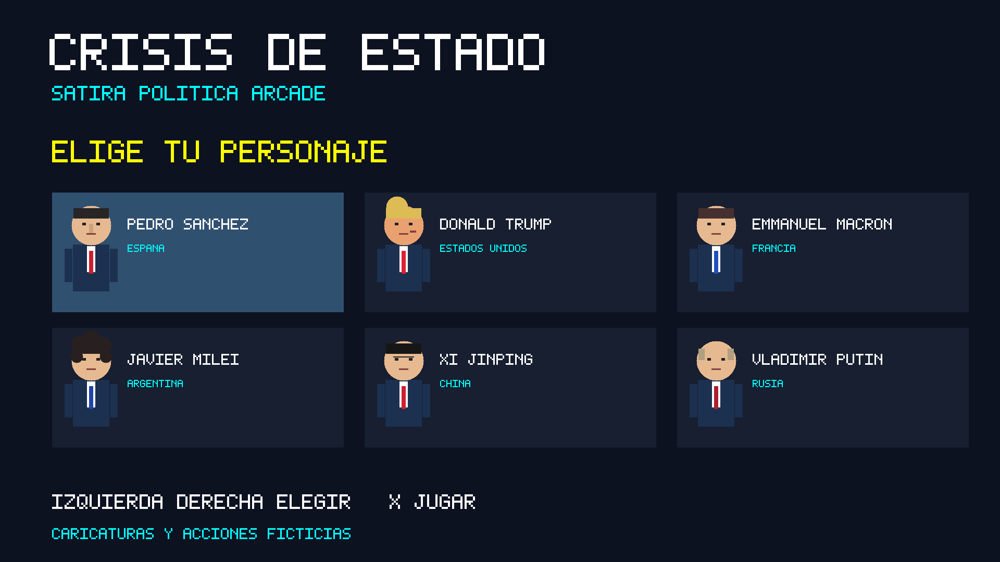

# Crisis de Estado — PS5 Homebrew

Beat’em up 2D de sátira política para PlayStation 5. C++20 nativo, controles DualSense y distribución en un contenedor `.exfat`.

**Versión 0.1.0 · Prototipo experimental · Title ID de desarrollo: `PPSA99763`**



## Estado

El ejecutable nativo se ha compilado y su contenedor FSELF se ha validado. La imagen exFAT está verificada con `fsck.exfat` y comparación de todos sus archivos. Las pruebas de lógica y entrada simulada se ejecutan en escritorio.

**La ejecución en una PS5 con firmware 13.60, Relapse, AutoWebKit 0.5.2, kstuff y ShadowMount está pendiente de validación en hardware.** Este es el entorno objetivo, no una certificación de compatibilidad. Las imágenes del README son renders de escritorio del mismo código de escenas, no capturas de una PS5.

## Incluido en v0.1

- Seis personajes seleccionables: Pedro Sánchez, Donald Trump, Emmanuel Macron, Javier Milei, Xi Jinping y Vladimir Putin.
- Países reales y caricaturas geométricas provisionales dibujadas por código.
- Una arena identificada como Madrid, España; tres oleadas con enemigos y puntuación.
- Movimiento en dos ejes, golpe, salto, bloqueo, especial y pausa.
- Vida, energía y medidor de corrupción arcade. Bebidas y maletines como objetos recogibles.
- Victoria, derrota y nueva partida. Congelación de la partida cuando el mando se desconecta.
- Icono propio para el menú de la consola e imagen `.exfat` con clústeres de 64 KiB.

Los nombres de los especiales varían entre personajes; en esta versión su mecánica base es compartida. No incluye sonido, guardado, cooperativo, vibración, gatillos adaptativos ni gráficos finales.

## Jugar

Con el entorno de homebrew ya operativo, copia `CrisisDeEstado-v0.1.exfat` a la carpeta `homebrew` del almacenamiento que ShadowMount tenga configurado para escanear. Una ruta habitual es `USB:/homebrew/CrisisDeEstado-v0.1.exfat`.

Espera a que el montador detecte y registre la aplicación; después abre **Crisis de Estado** desde el menú de juegos. Consulta [instalación y diagnóstico](docs/INSTALL.md) para evitar duplicar un mismo Title ID o confundir el juego con un payload ELF.

| Control | Acción |
| --- | --- |
| Cruceta izquierda / derecha en el menú | Elegir personaje |
| X en el menú / resultado | Empezar una partida |
| Stick izquierdo o cruceta en partida | Moverse |
| Cuadrado | Golpear; mantener para repetir con intervalo |
| X | Saltar |
| Triángulo | Especial, consume 40 de energía |
| Círculo mantenido | Bloquear; reduce el daño |
| OPTIONS | Pausar / continuar |
| Menú del sistema | Cerrar la aplicación |


## Compilar

En Ubuntu 24.04 o WSL2:

```bash
sudo apt update
sudo apt install clang-18 llvm-18-dev lld-18 make ninja-build ccache g++ python3 wget curl unzip tar exfatprogs
export LLVM_CONFIG=llvm-config-18
export TAR_OPTIONS=--no-same-owner
make
python3 tools/create-exfat.py dist/PPSA99763 dist/CrisisDeEstado-v0.1.exfat
fsck.exfat -n dist/CrisisDeEstado-v0.1.exfat
python3 tools/verify-exfat.py dist/CrisisDeEstado-v0.1.exfat dist/PPSA99763
```

La salida principal es `dist/PPSA99763/`, con `eboot.bin`, `sce_sys/`, `sce_module/` y `assets/`. No copies `eboot.bin` por separado. El packer rechaza sobrescribir una imagen existente.

## Licencia y créditos

GPL-3.0-or-later; ver [LICENSE](LICENSE) y [THIRD_PARTY_NOTICES.md](THIRD_PARTY_NOTICES.md). Basado en el toolchain público de PS5 y en `ps5-native-app-boilerplate`. No utiliza un SDK propietario de Sony ni incluye firmware, claves, kstuff, ShadowMount o exploits.

Obra de ficción satírica. Las acciones, poderes, combates y medidores son mecánicas ficticias; no representan afirmaciones sobre conductas reales ni respaldo de las personas representadas. Proyecto no oficial, sin afiliación con Sony Interactive Entertainment.
