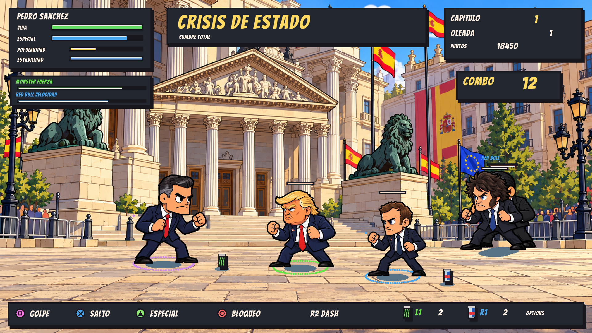

# Crisis de Estado — Cumbre Total

Beat'em up de sátira política para PS5 con jailbreak. **Versión 0.2.0**.



- Seis líderes: Pedro Sánchez, Donald Trump, Emmanuel Macron, Javier Milei, Xi Jinping y Vladimir Putin.
- Caricaturas reconocibles, escenario ilustrado del Congreso y estética de acción cartoon.
- Cinco capítulos en la misma plaza, tres oleadas por capítulo y cinco encuentros con jefe.
- Combos, salto, bloqueo, dash, partículas y seis especiales diferentes.
- Monster Energy: fuerza y resistencia durante 8 segundos. Red Bull: velocidad y ataques rápidos durante 6 segundos.
- Jugador y enemigos recogen y beben latas. Se pueden combinar los dos efectos.
- Controles DualSense; código de vibración y barra de luz incluidos.

## Jugar en PS5

Descomprime `CrisisDeEstado-v0.2.exfat.zip` y copia **el archivo `.exfat`** a `homebrew/` en la unidad que escanea ShadowMount. Con kstuff y ShadowMount activos, espera al registro y abre **Crisis de Estado - Cumbre Total** desde el menú de la consola.

Title ID de desarrollo: **PPSA99764**, distinto al de v0.1. Consulta [instalación](docs/INSTALL.md).

| Botón | Acción |
| --- | --- |
| Stick izquierdo / cruceta | Moverse |
| Cuadrado | Golpear / combo |
| X | Saltar / confirmar |
| Triángulo | Especial, 40 de energía |
| Círculo | Bloquear; volver al menú desde pausa |
| R2 | Dash |
| L1 | Beber Monster Energy |
| R1 | Beber Red Bull |
| OPTIONS | Pausar |

## Compilar

Ubuntu 24.04 o WSL2:

```bash
sudo apt update
sudo apt install clang-18 llvm-18-dev lld-18 make ninja-build g++ python3 wget curl unzip tar exfatprogs
export LLVM_CONFIG=/usr/bin/llvm-config-18
export TAR_OPTIONS=--no-same-owner
make USE_CCACHE=0 BUILD_JOBS=4
make gameplay-test preview
make exfat USE_CCACHE=0 BUILD_JOBS=4
```

La salida queda en `dist/`. [Guía de compilación](docs/BUILD.md) · [Publicar en GitHub](docs/GITHUB.md).

## Estado

Ejecutable nativo y runtime libre compilados; FSELF y estructura exFAT verificados. Pruebas de lógica y renders de escritorio del mismo código completados. **Arranque, rendimiento, vibración y barra de luz en PS5 13.60 pendientes de prueba en consola.**

Esta versión utiliza sprites con transformaciones y efectos, no animación esquelética. No incluye sonido, guardado ni cooperativo.

GPL-3.0-or-later. [Licencia](LICENSE) · [Créditos](THIRD_PARTY_NOTICES.md). Obra de ficción satírica; los poderes y combates son ficticios. Proyecto no oficial, sin afiliación con Sony, las personas representadas ni las marcas de bebidas.
